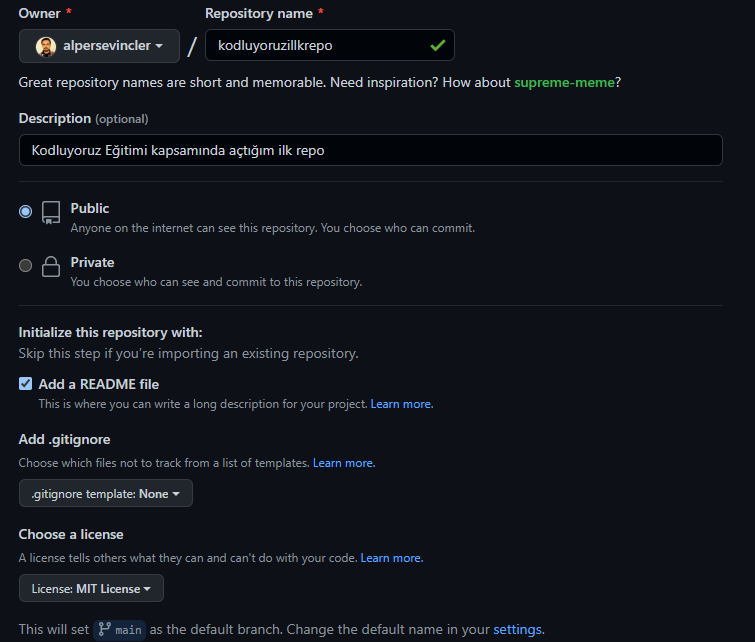

# Kodluyoruz Ilk Repo
Bu repo , [Kodluyoruz](https://www.kodluyoruz.org/)  Front-End Patikasının, GIT Eğitiminde oluşturduğumuz ilk repo. İçerisinde bir adet README dosyası, bir adet de index.html barındırıyor.
---
---

---
---
## Installation

Öncelikle projeyi cloneladık. (Buraya kendi reponuzdan aldığımız link gelecek)

```
git clone https://github.com/alpersevincler/kodluyoruzilkrepo.git
```
---
## Usage

Projeyi cloneladıktan sonra Visual Studio Code programında açınız.
```
Linux için:
cd kodluyoruzilkrepo
code .
```
***
## Contributing
Pull requestler kabul edilir. Büyük değişiklikler için, lütfen önce neyi değiştirmek istediğinizi tartışmak için bir konu açınız.
***
## License
[MIT](https://choosealicense.com/licenses/mit/)
***
[Patika.dev](https://www.patika.dev/)